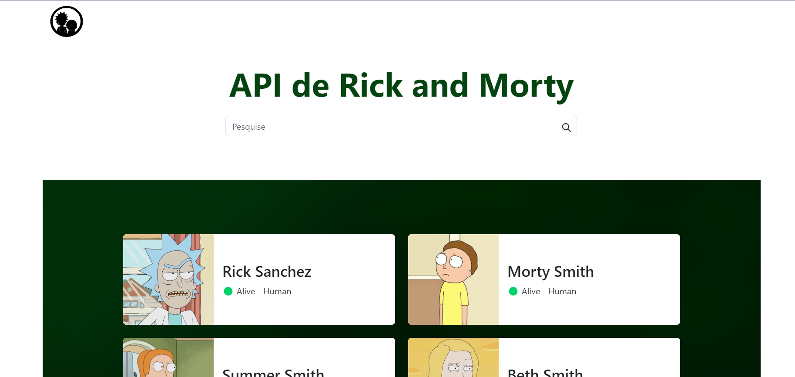
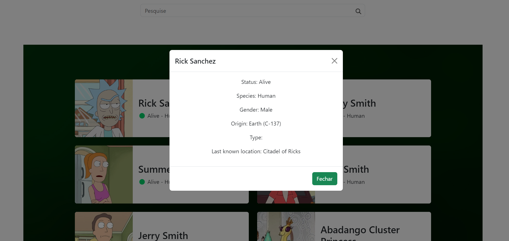

<h1 style="color: green">Rick and Morty</h1>

- Para a atividade de final de módulo foi usado a **API** de **Rick and Morty**

* Mas oque é uma **API** ?
  
- Uma API (Interface de Programação de Aplicações) é um conjunto de regras e definições que permite que diferentes sistemas de software se comuniquem entre si.
Ela define como as solicitações e as respostas devem ser feitas entre aplicações, permitindo a troca de dados e funcionalidades de forma padronizada.
Por exemplo, uma API pode permitir que um site ou aplicativo acesse informações de outro serviço, como a busca de dados em um banco de dados remoto.

- Nessa atividade usamos o Framework **Bootstrap** para responsividade em diferentes tamanhos de tela.

**Bootstrap**

- O Bootstrap é um framework front-end popular que facilita o desenvolvimento de sites e aplicativos web responsivos e modernos. Ele oferece uma coleção de ferramentas 
e componentes prontos, como layouts, botões, formulários e navegação, baseados em HTML, CSS e JavaScript. Com o Bootstrap, é mais fácil criar interfaces consistentes
e funcionais que se adaptam automaticamente a diferentes tamanhos de tela, sem precisar escrever muito código do zero.

- Nessa atividade contém uma barra de pesquisa onde podemos pesquisar o personagem pelo seu nome de origem, e ao clicar em cima de seu card será aberto um modal onde podemos ver também
as informações completa como espécie, gênero, tipo e etc ....

- Possui também botões de paginação para que seja mostrado mais personagens em outras páginas.

- Em alguns pontos especificos foram usados **keyframes**(animações) para dar movimento a certas partes da atividade, logotipo do rick and morty, transição dos cards e nos botões de
paginação.

**Keyframes**

- Um keyframe é um quadro-chave usado em animação para definir pontos importantes em uma sequência de movimento. Ele marca o início ou o fim de uma transição, e os quadros entre os
keyframes são interpolados para criar movimento suave. Em CSS, keyframes são usados para definir as etapas de uma animação, especificando os estilos que um elemento deve ter em
diferentes pontos durante a animação.

 
